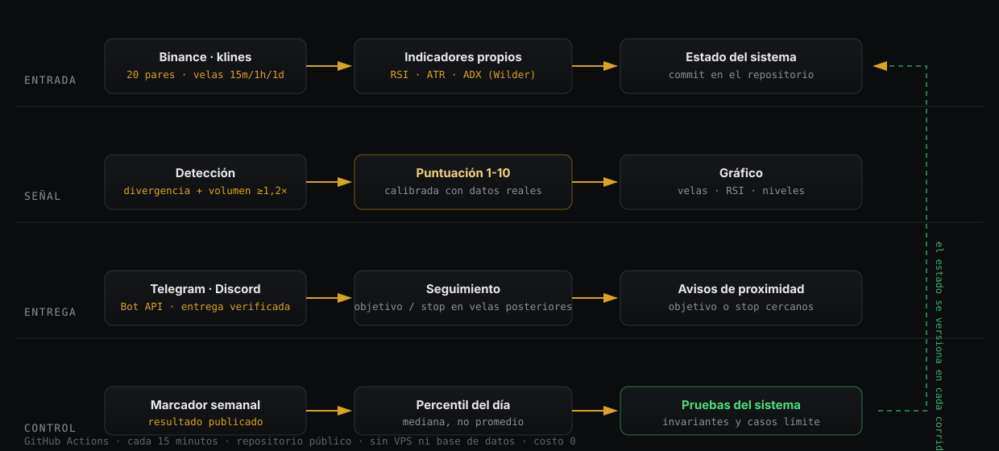

# Hermes Signal Bot

Sistema de detección de señales para Binance. Analiza 20 pares en cada pasada, detecta divergencias de
RSI confirmadas por volumen, asigna una puntuación calibrada, y notifica por Telegram y Discord con
gráfico y contexto de derivados. Posteriormente evalúa el resultado de cada señal y lo publica.

Alcance: sistema de notificación. No ejecuta operaciones, no administra claves de exchange y no tiene
acceso a fondos.

[](https://github.com/COEFR/Hermes-Signal-bot/actions/workflows/bot.yml)
[](https://github.com/COEFR/Hermes-Signal-bot/commits/main)
[](#)

## Arquitectura



La ejecución se programa mediante GitHub Actions: el runner se inicia cada 15 minutos, ejecuta los flujos
correspondientes a la hora del disparo y finaliza. No hay servidor ni base de datos; el estado se versiona
en el propio repositorio mediante commits.

## Flujos por pasada

| flujo | condición | función |
|---|---|---|
| `premium` | divergencia bajista, volumen ≥ 1,2× y ADX ≥ 20 | flujo principal de detección |
| `normales` | divergencias con ADX bajo | cobertura ampliada |
| `momentum` | máximo de 30 días en velas diarias | detección de continuidad |
| `rebote` | caída ≥ 5% en 1 hora con volumen 3× | detección de reversión |
| `contexto de mercado` | movimientos de BTC, funding en extremos | contexto general |
| `seguimiento` | señales abiertas | evaluación contra objetivo y stop |

Además: reporte diario a las 12:00 UTC y marcador semanal con gráfico los lunes a las 13:00 UTC.

## Parámetros

| parámetro | valor |
|---|---|
| pares analizados por pasada | 20 (top por volumen, más lista propia) |
| periodicidad de ejecución | 15 minutos |
| confirmación por volumen | ≥ 1,2× del promedio |
| filtro de tendencia | ADX ≥ 20 en el flujo principal |
| ventana de seguimiento | hasta cierre por objetivo o stop |

## Implementación

- **Indicadores propios.** RSI, ATR y ADX implementados según la formulación de Wilder, sin librerías
  intermedias. Cada uno incluye pruebas para los casos límite: series cortas, división por cero cuando la
  pérdida media es nula, y velas incompletas.
- **Puntuación.** Escala de 1 a 10 calibrada con datos históricos; los pesos no son arbitrarios.
- **Persistencia.** El estado (`state*.json` para deduplicación y enfriamiento, `signals_log.jsonl` para
  señales emitidas, `results.jsonl` para cierres, `ultimas_tareas.json` para el control diario) se
  versiona en el repositorio, dado que cada ejecución del runner comienza sin memoria.
- **Gráficos.** Los PNG se generan en cada señal y se envían adjuntos; no se versionan en el repositorio.
- **Credenciales.** Se inyectan desde los secretos del repositorio y nunca forman parte del código.

Ejemplo del motor de indicadores (`signals.py`):


## Una señal de ejemplo

Registro real del sistema (`signals_log.jsonl`):

```
MOMENTUM · máximo de 30 días
Par                 BATUSDT   (velas de 1 día)
Entrada             0.14180
Objetivo            0.17641      +24,4%
Stop                0.12450      -12,2%
Volatilidad (ATR)   8,14%
```

## Resultados medidos

Las mediciones completas están en `NOTAS.md`. Se incluyen los resultados negativos.

- Con 3 años de datos y 3 ventanas independientes, ninguna de las 10 combinaciones de dirección,
  temporalidad y nivel evaluadas resultó positiva en las tres ventanas.
- Los 9 indicadores complementarios probados no aportaron valor predictivo.
- Conclusión operativa: el sistema se utiliza como referencia de mercado. Cada alerta incluye el
  desempeño histórico medido del nivel correspondiente.

## Metodología

- **Evaluación por señal.** FDV al momento del aviso contra el máximo posterior, sobre la ventana de
  seguimiento. Los cierres se calculan contra objetivo y stop.
- **Puntaje por percentil diario.** La escala se recalibra con el mercado en lugar de acumular valores
  históricos.
- **Distribución aparte.** El percentil diario determina qué avisos se publican en cada canal.
- **Pruebas previas.** `tests_sistema.py` verifica invariantes y casos límite, y termina con código de
  salida igual a la cantidad de fallos.

## Estructura

| archivo | función |
|---|---|
| `signals.py` | motor: descarga de datos, indicadores, detección, formato y envío por Bot API |
| `chart.py` | generación de los gráficos (velas, volumen, RSI, divergencia y niveles) |
| `tracker.py` | evaluación de cada señal contra las velas posteriores |
| `scoring.py` + `score_calib.json` | puntuación 1-10 calibrada con datos reales |
| `mercado.py` | avisos de contexto (BTC, funding, amplitud) |
| `watchlist.py` | pares propios que se suman al top por volumen |
| `gh_run.py` | lanzador: selecciona los flujos según la hora del disparo |
| `salud.py` | auditoría del sistema; devuelve la cantidad de fallos como código de salida |
| `backtest.py`, `profit.py`, `salidas.py`, `niveles_long.py` | estudios de medición, documentados en `NOTAS.md` |
| `NOTAS.md` | registro completo de las mediciones, incluidos los resultados negativos |

## Verificación antes de publicar cambios

```bash
python tests_sistema.py            # invariantes, textos y casos límite
python salud.py --datos            # auditoría completa y datos crudos
python dev/prueba_clon_limpio.py   # clonado, instalación y ciclo en seco
```

## Uso

© COEFR. Uso personal. El contenido es informativo y no constituye asesoría financiera.
