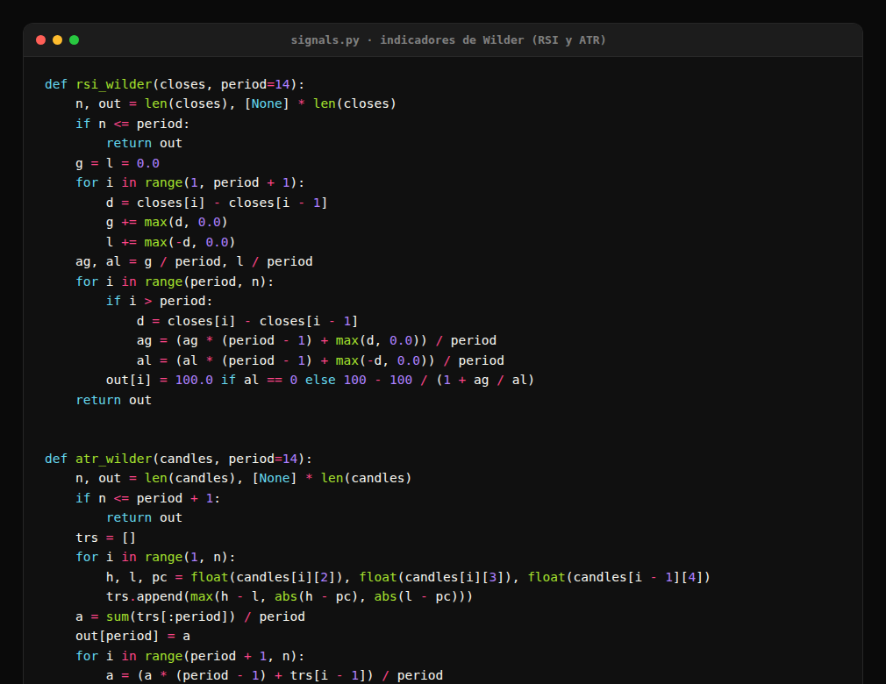

# Hermes Signal Bot

Escanea 20 pares de Binance cada 15 minutos buscando divergencias de RSI confirmadas por volumen. Cuando
encuentra una, la puntúa, la manda a Telegram y Discord con su gráfico, y anota entrada, objetivo y stop
para volver sobre ella más tarde y ver cómo terminó.

No hay servidor. Un workflow de GitHub Actions se despierta cada 15 minutos, corre los flujos y guarda su
estado en un commit: GitHub levanta la máquina, ejecuta el script y la apaga. Sin VPS, sin base de datos.

El bot no opera. No pide claves de exchange, no toca fondos y no manda órdenes. Solo avisa, y después
publica cómo le fue a cada señal.

[](https://github.com/COEFR/Hermes-Signal-bot/actions/workflows/bot.yml)
[](https://github.com/COEFR/Hermes-Signal-bot/commits/main)
[](#)
[](#)

## Qué corre en cada pasada

El lanzador es `gh_run.py` y decide qué flujos ejecutar según la hora que disparó el workflow.

| flujo | qué hace |
|---|---|
| `premium` | divergencia bajista con volumen de al menos 1,2× y ADX de 20 para arriba. Es el flujo principal |
| `normales` | divergencias con ADX bajo: hace de radar y suma más cantidad de señales |
| `momentum` | máximo nuevo de 30 días en velas diarias |
| `rebote` | caída de 5% o más en una hora con el triple de volumen |
| `contexto de mercado` | BTC moviéndose fuerte, funding en extremos, amplitud del mercado |
| `seguimiento` | revisa las señales abiertas contra objetivo y stop, y avisa cuando alguno queda cerca |

Aparte de eso, todos los días a las 12:00 UTC manda un reporte, y los lunes a las 13:00 el marcador de la
semana con su gráfico.

## Una alerta de ejemplo

Este es un mensaje real, sacado del registro de señales (`signals_log.jsonl`):

```
MOMENTUM · nuevo máximo de 30 días
Par                 BATUSDT   (velas de 1 día)
Entrada             0.14180
Objetivo            0.17641      +24,4%
Stop                0.12450      -12,2%
Volatilidad (ATR)   8,14%
```

Cada alerta va con su gráfico: velas, volumen, RSI, la divergencia marcada y los niveles. Cuando la señal
se cierra, el bot publica si llegó al objetivo o si saltó el stop.

## Los indicadores, escritos a mano

RSI, ATR y ADX son implementaciones propias que siguen la formulación original de Wilder. No hay librerías
de indicadores escondiendo la cuenta, y cada una tiene pruebas para los casos límite: series cortas,
división por cero cuando la pérdida media da 0, y velas incompletas.



## Estructura

| archivo | qué es |
|---|---|
| `signals.py` | el motor: baja los datos de Binance, calcula los indicadores, detecta la divergencia, arma el mensaje y lo envía por la Bot API |
| `chart.py` | dibuja los PNG: velas, volumen, RSI, la divergencia y los niveles, más el gráfico del cierre |
| `tracker.py` | agarra cada señal enviada, la compara con las velas que vinieron después y publica el resultado |
| `scoring.py` + `score_calib.json` | el puntaje de 1 a 10, calibrado con datos reales en vez de pesos inventados |
| `mercado.py` | avisos de contexto: BTC, funding, amplitud |
| `watchlist.py` | pares propios que se suman al top por volumen |
| `gh_run.py` | el lanzador que elige los flujos según la hora |
| `salud.py` | auditoría del sistema completo; devuelve la cantidad de fallos como código de salida |
| `backtest.py`, `profit.py`, `salidas.py`, `candidatas*.py`, `niveles_long.py` | estudios de medición, documentados en `NOTAS.md` |
| `NOTAS.md` | todas las mediciones, incluidas las que no funcionaron |

## Estado y secretos

En GitHub Actions cada corrida arranca sin memoria, así que el estado vive en el propio repositorio y se
actualiza con un commit en cada pasada: `state*.json` para el dedupe y los cooldowns, `signals_log.jsonl`
con las señales enviadas, `results.jsonl` con los cierres y `ultimas_tareas.json` para no repetir el
reporte del día. Los gráficos no se versionan porque van adjuntos en el mensaje: la carpeta `charts/` está
ignorada.

Los secretos van en GitHub Secrets, nunca en el código:

| secreto | para qué |
|---|---|
| `TELEGRAM_BOT_TOKEN` · `TELEGRAM_HOME_CHANNEL` | los avisos por Telegram |
| `DISCORD_BOT_TOKEN` · `DISCORD_HOME_CHANNEL` · `DISCORD_SIGNALS_CHANNEL` | los avisos por Discord |

## Antes de publicar un cambio

```bash
python tests_sistema.py            # invariantes de las señales, textos limpios y casos borde
python salud.py --datos            # auditoría completa + datos crudos + temporalidades
python dev/prueba_clon_limpio.py   # clona el repo, instala desde cero y corre el ciclo en seco
```

`tests_sistema.py` cubre las fallas que ya aparecieron en este proyecto: textos con `None`, niveles del
lado equivocado, crashes con datos incompletos, estado corrupto, precios minúsculos y el plan de flujos.
Termina con código de salida igual a la cantidad de fallos.

## Lo que dicen los números

Conviene leerlo antes de confiar en cualquier señal. Las mediciones están en `NOTAS.md` y no son lindas:
con 3 años de datos y 3 ventanas independientes, ninguna de las 10 combinaciones de dirección,
temporalidad y nivel da positivo en las tres, y los 9 indicadores extra que probamos fallaron. El bot es
un radar para mirar el mercado, no una fuente de rentabilidad. Por eso cada alerta muestra el histórico
medido de ese nivel y el bot publica su propio marcador: la idea es que no haya que creerle a la promesa
sino a los números.

## Licencia

© COEFR. Uso personal. Nada de esto es asesoría financiera.
